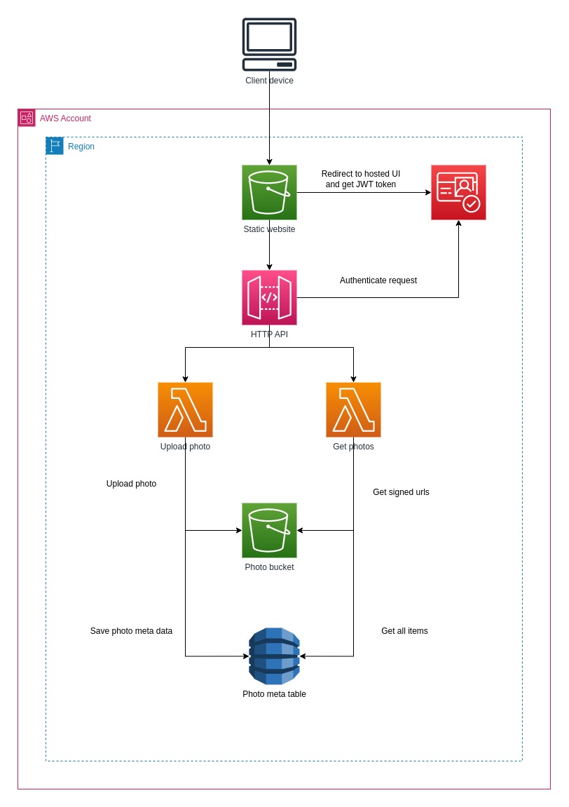

# Photo Gallery App

> Serverless web application built to showcase and share photos. 
> Admin users can upload and others can see the photos. There is an option to share public photos as well.

## Solution Diagram


## Run Application
### Prerequisites

- Install AWS CLI https://docs.aws.amazon.com/cli/latest/userguide/getting-started-install.html
- Configure AWS CLI credentials https://docs.aws.amazon.com/cli/latest/userguide/cli-configure-files.html
- Create S3 bucket for the Cloudformation deployment and update root package.json `package` script with the bucket name in `--s3-bucket`

### Automated Scripts

```
# Build lambdas and frontend locally
npm run build

# Package Cloudformation resources
npm run package

# Deploy resources to AWS
npm run deploy
```
### Manual Tasks
Please follow below steps manually since those are yet to be implemented

- Grant API Gateway permission to invoke Lambda function
- Copy output `CognitoSignupURL` to index.html a tag with id `#cognitoSignupUrl`
- Copy output `HttpApiEndpoint` to /frontend/src/config baseUrl
- Run `npm run build` from the root directory
- Upload /frontend index.html, error.html, and dist/ to static site S3 bucket
- Create a user with username `john` in Cognito user pool
- Run the front end and login using above credentials
  Note: Logout feature yet to be implemented. So delete the local storage `cognitoToken` manually to logout

## Improvements to be done

- Role base authentication for admins and normal users
- Proper script to build lambdas and frontend
- Create API gateway lambdas event sources by cloudformation
- Automate uploading frontend files to static S3 bucket
- Frontend UI, folder structure and JS codes
- Lambda error handling, responses and logs
- Should not get S3 signed url every time we send a get photos request. Generated signed url can be reuse till it expires
- Use DynamoDB queries instead of scan
